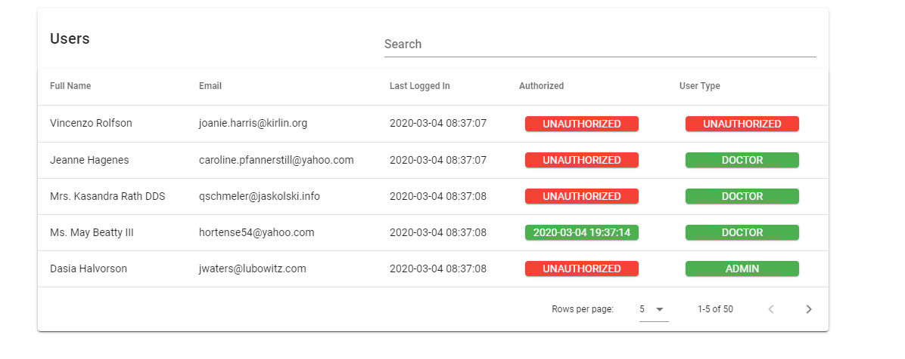

Steps to do : 

1: Create mysql database 'laravel'

2: run command 'npm i'

3: cd into the cloned folder, run command 'php artisan migrate'

4: run command 'php artisan db:seed'

5: run command 'php artisan serve'

if you changed any file you need to build the project by running comman 'npm run dev' otherwise changes will not be visible upon 'php artisan serve'

## Demo Screenshot

